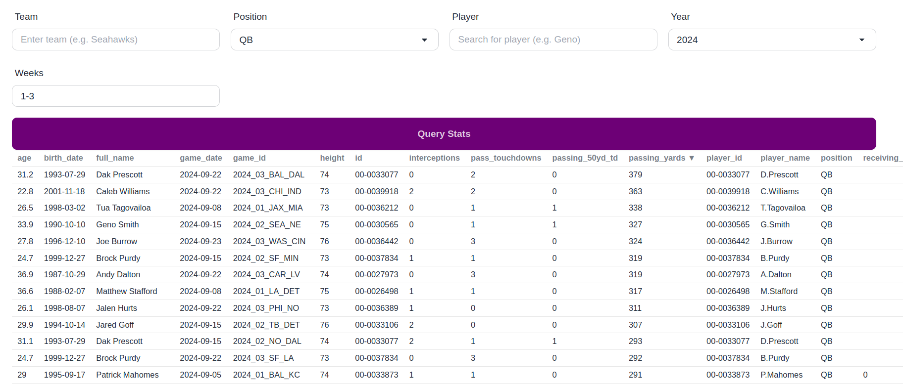

## Melange

Melange is an experiment in using [spice.ai](https://spice.ai) to explore NFL data in the aim of developing Fantasy Football strategy.

> _The spice must flow._
>                 _-Dune_

[](screenshot.png)

## Status

Experimental (mainly to try out Spice.ai OSS). For now, Melange reimplements part of the pola.rs exploration from [fantasy-football-forecasting](https://github.com/anowell/fantasy-football-forecasting). Melange:

- uses a spicepod to manage datasets with years of play-by-play and weekly roster data
- exposes a CLI, API, and web UI to explore the data
- play-by-play statistics that are used in fantasy scoring calculations
- weekly roster data gives additional player info and means of filtering and pivoting data for analysis
- coming soon: fantasy scoring, aggregations, and LLM-assisted exploration of data

## Usage

Install spice (CLI or Docker container), then start spice.

```bash
# Create and configure .env
cp .env.sample .env
$EDITOR .env

# Local CLI
spice run

# Or Docker (in theory?)
docker run --rm -it -p 8090:8090 -v $(pwd)/spicepod.yaml:/app/spicepod.yaml spiceai/spiceai
```

Run melange website:

```bash
# Start API
just dev

# Start dev frontend
just webdev
```

Run melange CLI:

```
$ cargo run -- --help
Usage: melange [OPTIONS]

Options:
  -v, --verbose...
  -y, --year <YEAR>      Loads data for a given year [default: 2024]
      --player <PLAYER>  Filter by team
  -w, --week <WEEKS>     Filtering week number or range (e.g. 3 or 3-5)
  -t, --team <TEAM>      Filter by team
  -h, --help             Print help
  -V, --version          Print version
``
